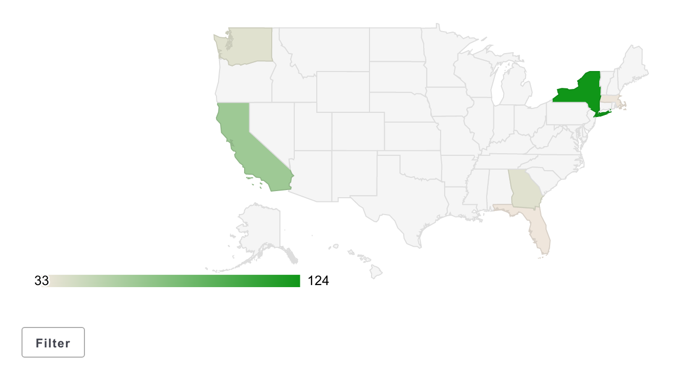

# About nuxeo-labs-geomap

A Nuxeo Package that provides a Content View filter widget to display a geographical map of aggregate data for filtering. I.e. you might show cases per State, and if the user clicks a State, the cases are filtered to that State.



The widget uses a [Polymer-based](https://www.polymer-project.org/1.0/) application to display a [`nuxeo-labs-map-chart`](https://github.com/nuxeo-sandbox/nuxeo-labs-elements). The chart requires geographic data of course. The acceptable formats are listed [here](https://developers.google.com/chart/interactive/docs/gallery/geochart#regions-mode-format). The widget expects this data to be delivered by way of a `Terms` aggregation widget. This is because the `<aggregation>` id is also used as the property id for the aggregation data when returned by Page Provider for the Content View. See below for more details.

## Usage

The widget can be configured entirely in Nuxeo Studio.  Given a Content View, follow these instructions:

1. Add and configure a [Terms Aggregate](https://doc.nuxeo.com/display/NXDOC/How+to+Configure+a+Search+Filter+With+Facets+and+Other+Aggregates#HowtoConfigureaSearchFilterWithFacetsandOtherAggregates-TermsAggregate) to the Content View Search Layout
  * Be sure to enable "Hide label"
  * Set the "Style" property to `display: none`
1. Get the `id` of the `<aggregate>` contribution; the ids follow the format `schema_field_#_agg` but it's better to get the exact id than to guess:
  * Download the Studio project
  * Extract the Studio JAR file
  * Open the `OSGI-INF/extensions.xml` file
  * Locate the `<aggregate>` contribution for the Content View and make note of the `id`; for example:
  ```
  <aggregate id="case_State_1_agg" type="terms" parameter="case:State">
    <field schema="DefaultContentListingInNavigation_cv" name="case_State_1_agg"/>
    <properties>
      <property name="order">count desc</property>
    </properties>
  </aggregate>
  ```
1. Add a "Generic Search" widget and configure as follows:
  * Set the "Field" to the same value as the Terms Aggregate
  * Set "Widget Type" to `template`
  * Add the following custom properties:
    * template = `/widgets/geomap-filter-widget.xhtml`
    * region = as documented [here](https://developers.google.com/chart/interactive/docs/gallery/geochart#regions-mode-format)), e.g. `world` or `US`
    * resolution = one of `countries`, `provinces`, or `metros`; note that `provinces` is the correct value for US States
    * aggregateName = the `id` of the `<aggregate>` contribution located previously
    * title = a title for the chart; note that this is only used when the mouse hovers over the chart; *optional*
    * chartWidth = width in pixels; *optional*, default is 400
    * chartHeight = height in pixels; *optional*, default is 300

## Building

[](https://qa.nuxeo.org/jenkins/view/sandbox/job/Sandbox/job/sandbox_nuxeo-cm-demo-utils-master/)

After cloning, and assuming `maven` is correctly installed:

`mvn install`

The Nuxeo Package will be placed at is in `nuxeo-labs-geomap-marketplace/target/`.

## Support

**These features are not part of the Nuxeo Production platform.**

These solutions are provided for inspiration and we encourage customers to use them as code samples and learning resources.

This is a moving project (no API maintenance, no deprecation process, etc.) If any of these solutions are found to be useful for the Nuxeo Platform in general, they will be integrated directly into platform, not maintained here.

## Licensing

[Apache License, Version 2.0](http://www.apache.org/licenses/LICENSE-2.0)

## About Nuxeo

Nuxeo dramatically improves how content-based applications are built, managed and deployed, making customers more agile, innovative and successful. Nuxeo provides a next generation, enterprise ready platform for building traditional and cutting-edge content oriented applications. Combining a powerful application development environment with SaaS-based tools and a modular architecture, the Nuxeo Platform and Products provide clear business value to some of the most recognizable brands including Verizon, Electronic Arts, Netflix, Sharp, FICO, the U.S. Navy, and Boeing. Nuxeo is headquartered in New York and Paris.

More information is available at [www.nuxeo.com](http://www.nuxeo.com).
